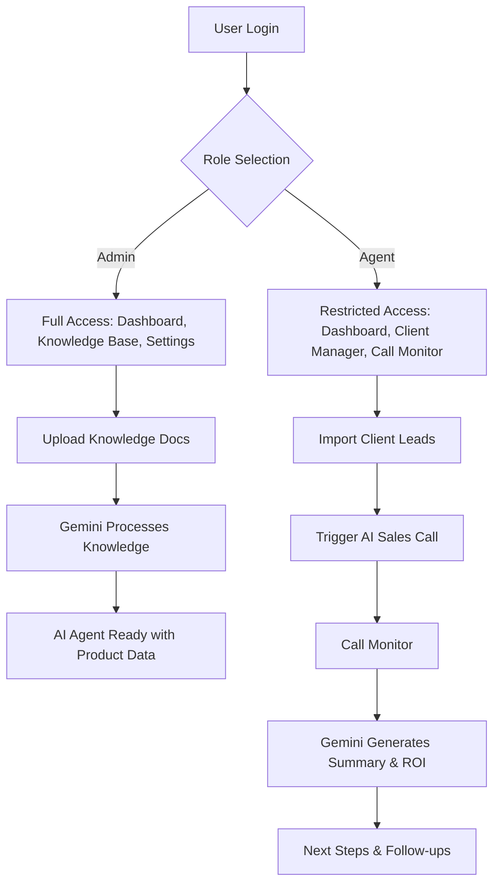
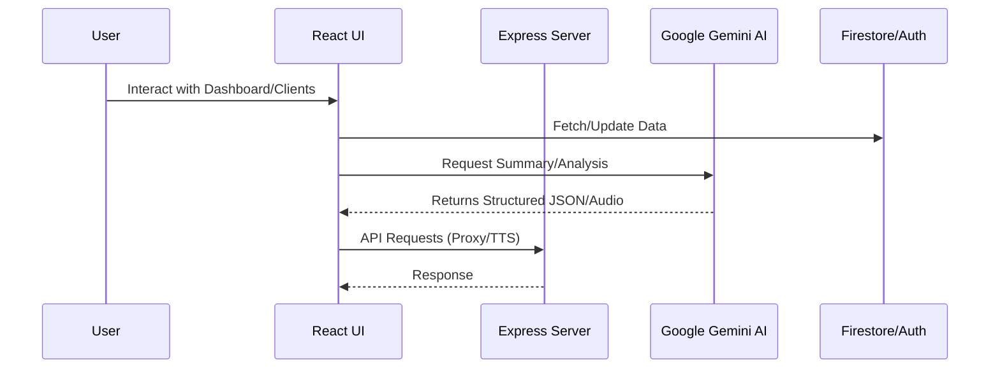

# VocalBridge Sales AI 🚀

VocalBridge is a next-generation, AI-powered sales enablement platform designed to automate and optimize sales conversations. Leveraging the power of Google Gemini, it provides a seamless interface for managing clients, monitoring AI-driven calls, and building a robust knowledge base for autonomous sales agents.

## 🌟 Key Features

- **📊 Intelligent Dashboard**: Real-time overview of sales performance, revenue projections, and lead conversion metrics.
- **👥 Advanced Client Manager**: Effortlessly manage leads, upload CSV batches, and track individual customer journeys.
- **🎙️ Real-time Call Monitor**: Listen to AI-driven calls and view instant, Gemini-powered summaries, sentiment analysis, and ROI projections.
- **📚 Smart Knowledge Base**: Upload product documents or website URLs. Gemini automatically structures this data into a searchable knowledge base for the AI agents.
- **🎭 Persona Switching**: Switch between Admin and Agent views to manage the system or focus on individual sales tasks.
- **🗣️ Dynamic AI Voice**: Customizable Text-to-Speech (TTS) using Gemini's latest flash models for natural, human-like conversations.

## 🛠️ Technology Stack

- **Frontend**: [React](https://reactjs.org/) + [TypeScript](https://www.typescriptlang.org/)
- **Build Tool**: [Vite](https://vitejs.dev/)
- **Styling**: [Tailwind CSS](https://tailwindcss.com/)
- **Animations**: [Framer Motion](https://www.framer.com/motion/)
- **AI Engine**: [Google Gemini API](https://aistudio.google.com/)
- **Backend/Database**: [Firebase](https://firebase.google.com/) (Auth, Firestore)
- **Icons**: [Lucide React](https://lucide.dev/)

---

## 🔄 User Flow



## 🏗️ System Architecture



---

## 🚀 Getting Started (Local Run)

### Prerequisites

- [Node.js](https://nodejs.org/) (v18 or higher)
- [npm](https://www.npmjs.com/) or [yarn](https://yarnpkg.com/)
- Google Gemini API Key

### Installation

1.  **Clone the repository**:
    ```bash
    git clone <repository-url>
    cd vocalbridge-sales-ai
    ```

2.  **Install dependencies**:
    ```bash
    npm install
    ```

3.  **Configure Environment Variables**:
    Create a `.env` file in the root directory and add your Gemini API key:
    ```env
    GEMINI_API_KEY=your_gemini_api_key_here
    ```

4.  **Run the application**:
    ```bash
    npm run dev
    ```

5.  **Access the App**:
    Open [http://localhost:3000](http://localhost:3000) in your browser.

---

## 📁 Project Structure

- `src/components`: UI components (Dashboard, CallMonitor, KnowledgeBase, etc.)
- `src/services`: Integration with Firebase and Gemini AI.
- `src/lib`: Shared utilities and Firebase configuration.
- `server.ts`: Express server handling Vite middleware and API stubs.
- `firebase-blueprint.json`: Pre-defined structure for Firestore collections.

## 📜 License

MIT License. See `LICENSE` for details.
