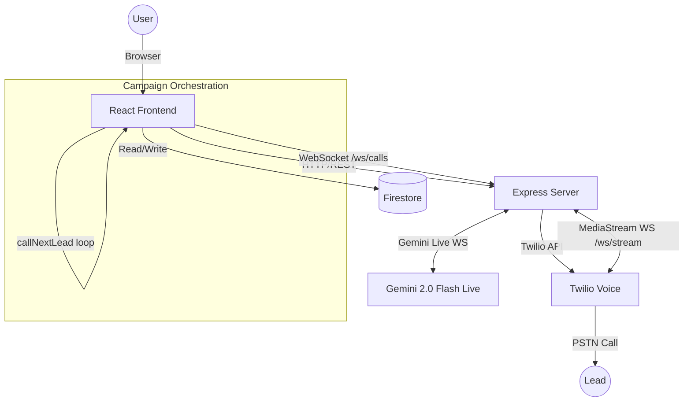
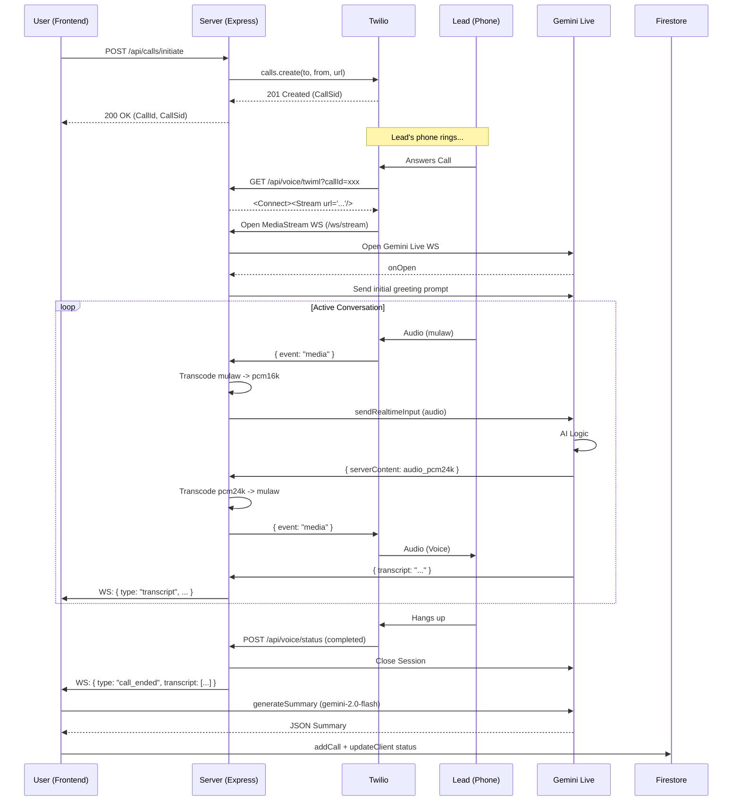
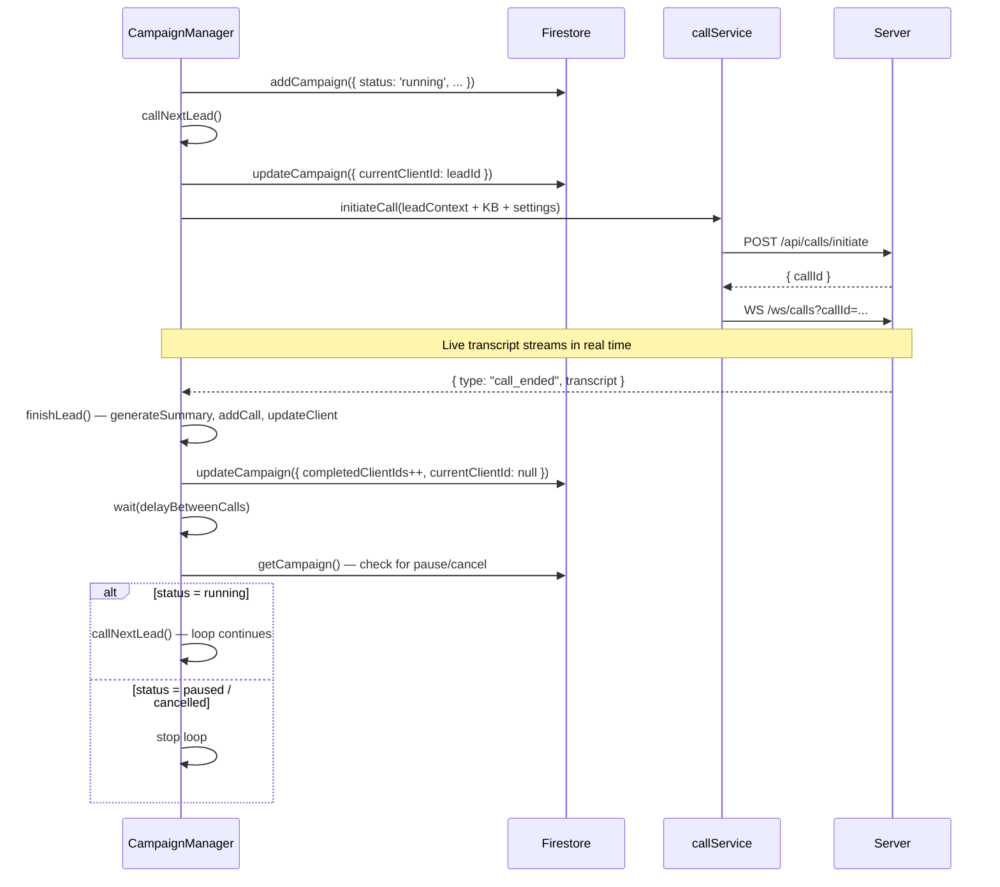
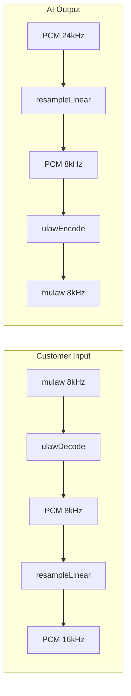
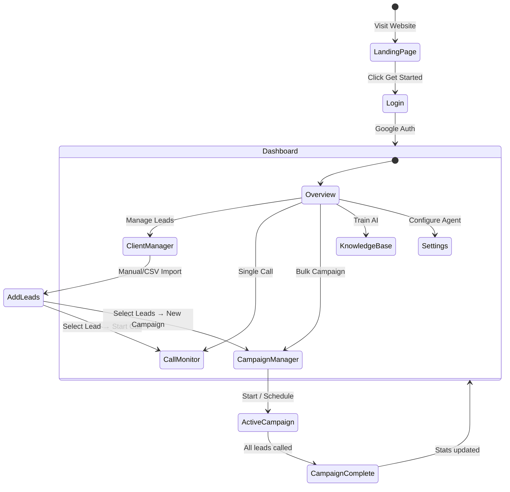
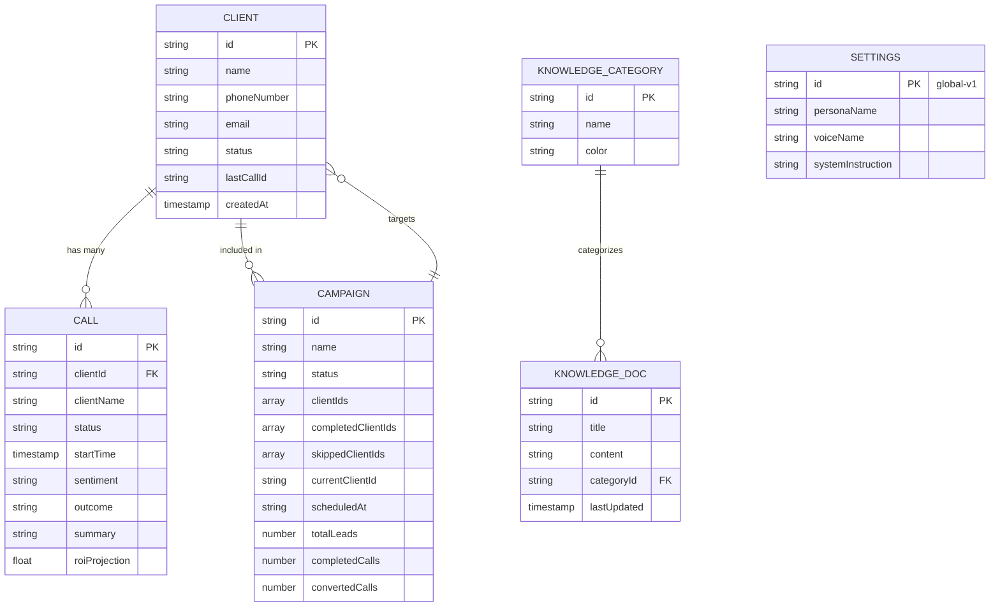

# VocalBridge Sales AI

AI-powered outbound sales automation platform. Deploys a Gemini AI voice agent that calls leads, holds natural conversations, handles objections, and logs every call with transcript, sentiment analysis, and ROI projection.

---

## Table of Contents

- [Overview](#overview)
- [Features](#features)
- [Tech Stack](#tech-stack)
- [Architecture](#architecture)
  - [Call Flow](#call-flow)
  - [Audio Bridge](#audio-bridge)
  - [Frontend Architecture](#frontend-architecture)
- [Project Structure](#project-structure)
- [Prerequisites](#prerequisites)
- [Installation](#installation)
- [Environment Variables](#environment-variables)
- [Firebase Setup](#firebase-setup)
- [Twilio Setup](#twilio-setup)
- [Running Locally](#running-locally)
- [ngrok (Required for Live Calls)](#ngrok-required-for-live-calls)
- [Scripts](#scripts)
- [API Reference](#api-reference)
- [WebSocket Protocols](#websocket-protocols)
- [Role-Based Access](#role-based-access)
- [Firestore Collections](#firestore-collections)
- [Gemini Models Used](#gemini-models-used)
- [Deployment](#deployment)
- [Troubleshooting](#troubleshooting)

---

## Overview

VocalBridge is a SaaS platform that automates outbound sales calls using Google Gemini's Live API. When a call is initiated, the system:

1. Places a real phone call via Twilio to the lead
2. Opens a real-time audio bridge between Twilio and Gemini Live
3. Gemini speaks and listens simultaneously — no TTS/STT pipeline latency
4. The AI handles the full conversation: greeting, pitch, objection handling, scheduling
5. Transcripts stream in real time to the operator dashboard
6. After the call, Gemini generates a summary, sentiment score, and ROI projection
7. Everything is saved to Firestore and reflected on the analytics dashboard

With the **Campaign Manager**, operators can select any group of leads, press one button, and the AI will call them sequentially — fully automated, with pause/resume/cancel controls and a live queue dashboard.

---

## Features

### Dashboard
- Live metrics: total leads, calls completed, conversion rate, projected revenue
- Revenue trend chart (Recharts)
- Recent call log with sentiment badges
- Data fetched directly from Firestore in real time

### Client Manager
- Add, search, and delete leads
- CSV import (bulk upload with `name`, `phone`, `email`, `info`, `tags` columns)
- CSV export (exports current filtered view)
- Tag-based filtering
- Pagination (25 leads per page)
- Per-lead call history modal — full transcript, summary, ROI, and sentiment for every past call

### Call Monitor
- **Real Call mode**: initiates a live Twilio outbound call using Gemini Live API
- **Demo mode**: simulated call with scripted transcript for testing without a phone
- Real-time transcript display (WebSocket-powered, streams as the call happens)
- Interrupt detection — UI clears audio buffer when customer talks over the agent
- Post-call summary generated by Gemini (`gemini-2.0-flash`)
- Saves completed call to Firestore, updates lead status

### Campaign Manager *(Admin only)*
- Create a named campaign by selecting any group of leads from the Client Manager
- **Filters**: search by name/phone, filter by status (`pending`, `follow-up`, `all`), filter by tag
- **"Select All Filtered"** checkbox to bulk-add an entire filtered view
- **Start immediately** or **schedule for a specific date and time** — auto-starts when the browser is open at the scheduled time
- Configurable **delay between calls** (5 / 10 / 30 / 60 seconds) and **retry no-answer** toggle
- Campaign detail view with:
  - Animated progress bar (`completed / total` calls)
  - Live call queue panel — pending leads (numbered), current lead (pulsing), completed leads with outcome chips
  - Live call terminal — real-time transcript, duration timer, dialing/analyzing states
  - Pause / Resume / Cancel controls
  - Post-campaign aggregate stats (calls, conversions, conversion rate)
- All campaign state persisted in Firestore — survives page refresh
- Orchestration runs entirely in the browser (no backend changes needed) — compatible with free-tier Render

### Knowledge Base
- Upload product documents (plain text, pasted content)
- URL ingestion (UI-only, requires server-side proxy for production scraping)
- Gemini processes documents and structures them into categorized entries
- Categories with color labels
- Admin-only access
- KB docs are passed to every call as context (grouped by category in the AI system instruction)

### Settings
- AI persona configuration: name, tone, speech patterns, system instruction
- Voice selection (8 Gemini prebuilt voices: Kore, Charon, Fenrir, Aoede, etc.)
- Voice speed, pitch, and inflection sliders (UI-ready)
- Voice cloning (UI-only simulation)
- All settings persisted to Firestore `settings/global-v1`
- Settings are loaded and injected into every call (single manual call or campaign)

### Auth
- Google OAuth via Firebase Auth
- Anonymous sign-in for quick access
- `localStorage` test mode bypass (`vocalbridge_test_mode=true`)
- Role-based access: Admin vs Agent

### Public Pages
- `/` — Marketing landing page
- `/docs` — Full user documentation with getting started guide, feature walkthroughs, and troubleshooting

---

## Tech Stack

| Layer | Technology |
|-------|-----------|
| Frontend | React 19, TypeScript 5.8, Vite 6.2 |
| Styling | Tailwind CSS 4, Framer Motion (motion/react v12) |
| Routing | React Router DOM v7 |
| Charts | Recharts |
| Auth | Firebase Auth (Google OAuth + Anonymous) |
| Database | Firebase Firestore |
| AI — Text | Google Gemini `gemini-2.0-flash` |
| AI — Live Voice | Google Gemini `gemini-2.0-flash-live-001` |
| SDK | `@google/genai` v1.51+ |
| Telephony | Twilio Programmable Voice |
| Server | Express.js 4.21 (Node.js) |
| WebSocket | `ws` library (Node.js) |
| CSV | PapaParse |
| Icons | Lucide React |

---

## Architecture

### System Overview

VocalBridge is split into a **Vite/React Frontend** and a **Node.js/Express Backend** that serves as a low-latency bridge between Twilio and Gemini Live.



### Call Flow Sequence

This diagram illustrates the lifecycle of a call, from the user clicking "Start Call" to the AI hanging up and generating a summary.



### Campaign Orchestration Flow

The Campaign Manager orchestrates calls entirely on the frontend. Firestore persists state — the loop survives page refresh if the user navigates away and returns.



### Audio Bridge Transcoding

The server handles real-time transcoding to bridge the gap between telephony standards and modern AI requirements.



### Frontend Architecture

The application uses a modular structure with individual error boundaries for every major route to ensure high reliability.

```text
App.tsx (Router & Auth Guard)
├── Public Layer
│   ├── / (LandingPage)
│   └── /docs (DocsPage)
└── Application Layer (Authenticated)
    └── AppLayout (Sidebar + Shell)
        ├── ErrorBoundary (Dashboard)
        ├── ErrorBoundary (ClientManager)
        ├── ErrorBoundary (CallMonitor)
        ├── ErrorBoundary (KnowledgeBase)   — admin only
        ├── ErrorBoundary (CampaignManager) — admin only
        └── ErrorBoundary (Settings)        — admin only
```

Each route is individually wrapped in `<ErrorBoundary>`. A crash in one component does not take down the whole app.

### User Flow



### Entity Relationship (ER) Diagram

VocalBridge uses a schema-less Firestore database with a structured relational design for data integrity.



---

## Project Structure

```
vocalbridge-sales-ai/
├── src/
│   ├── App.tsx                   # Router, auth guard, sidebar layout, ErrorBoundary
│   ├── components/
│   │   ├── Dashboard.tsx         # Metrics, charts, recent calls (live Firestore)
│   │   ├── ClientManager.tsx     # Lead table, CSV import/export, pagination, call history modal
│   │   ├── CallMonitor.tsx       # Real call + demo mode, live transcript WebSocket
│   │   ├── KnowledgeBase.tsx     # Doc upload, URL ingestion, Gemini processing
│   │   ├── Settings.tsx          # Persona + voice config, saved to Firestore
│   │   ├── Login.tsx             # Google OAuth + test mode bypass
│   │   └── ErrorBoundary.tsx     # Class component, wraps each route
│   ├── pages/
│   │   ├── LandingPage.tsx       # Public marketing page at /
│   │   ├── DocsPage.tsx          # Public documentation at /docs
│   │   └── CampaignManager.tsx   # Bulk campaign orchestration at /campaigns
│   ├── services/
│   │   ├── geminiService.ts      # Gemini text API — post-call summary, KB processing
│   │   ├── firebaseService.ts    # All Firestore CRUD operations (clients, calls, KB, campaigns)
│   │   └── callService.ts        # Frontend: initiate/end calls + WebSocket transcript
│   ├── types/
│   │   └── index.ts              # TypeScript interfaces: Client, Call, Campaign, Settings, …
│   ├── lib/
│   │   ├── firebase.ts           # Firebase app init + auth/db exports
│   │   └── utils.ts              # cn(), formatPhoneNumber(), formatDate()
│   └── vite-env.d.ts             # Vite ImportMeta.env type declarations
├── server.ts                     # Express + Twilio + Gemini Live audio bridge
├── render.yaml                   # Render deployment config
├── .env                          # Secret keys (gitignored)
├── .env.example                  # Template for environment variables
├── vite.config.ts                # Vite config
├── tailwind.config.ts            # Tailwind config
├── tsconfig.json                 # TypeScript config
└── package.json
```

---

## Prerequisites

- **Node.js** v18 or higher (`node -v`)
- **npm** v9 or higher (`npm -v`)
- **Google Gemini API key** — [aistudio.google.com](https://aistudio.google.com)
- **Firebase project** — Auth + Firestore enabled ([console.firebase.google.com](https://console.firebase.google.com))
- **Twilio account** — for live outbound calls ([twilio.com](https://www.twilio.com))
- **ngrok** — to expose local server for Twilio webhooks during development

---

## Installation

```bash
# 1. Clone the repository
git clone <repository-url>
cd vocalbridge-sales-ai

# 2. Install dependencies
npm install

# 3. Copy the environment template
cp .env.example .env

# 4. Fill in .env (see Environment Variables section below)
```

---

## Environment Variables

Create a `.env` file in the project root with the following values:

```env
# ── Gemini AI ──────────────────────────────────────────────────────
GEMINI_API_KEY=your_gemini_api_key_here

# ── Twilio ─────────────────────────────────────────────────────────
TWILIO_ACCOUNT_SID=ACxxxxxxxxxxxxxxxxxxxxxxxxxxxxxxxxxx
TWILIO_AUTH_TOKEN=your_twilio_auth_token
TWILIO_PHONE_NUMBER=+1XXXXXXXXXX

# ── Server ─────────────────────────────────────────────────────────
# For local dev: set to your ngrok HTTPS URL
# For production: set to your deployed server URL (e.g. Render)
PUBLIC_SERVER_URL=https://your-ngrok-url.ngrok-free.app

PORT=3000
NODE_ENV=development

# ── Frontend → External backend (optional) ─────────────────────────
# Set this when the frontend (Vercel) and backend (Render) are deployed separately.
# Leave empty in local dev — the frontend uses the same-origin Express server.
VITE_SERVER_URL=https://vocalbridge-sales-ai.onrender.com

# ── Firebase (Frontend — must be prefixed VITE_) ───────────────────
VITE_FIREBASE_API_KEY=AIzaSy...
VITE_FIREBASE_AUTH_DOMAIN=your-project.firebaseapp.com
VITE_FIREBASE_PROJECT_ID=your-project-id
VITE_FIREBASE_STORAGE_BUCKET=your-project.firebasestorage.app
VITE_FIREBASE_MESSAGING_SENDER_ID=000000000000
VITE_FIREBASE_APP_ID=1:000000000000:web:xxxxxxxxxxxx
VITE_FIREBASE_DATABASE_ID=(default)
```

| Variable | Required | Description |
|----------|:--------:|-------------|
| `GEMINI_API_KEY` | Yes | Server-side only. Powers Gemini Live calls and post-call summaries. |
| `TWILIO_ACCOUNT_SID` | For live calls | From [Twilio Console](https://console.twilio.com) |
| `TWILIO_AUTH_TOKEN` | For live calls | From [Twilio Console](https://console.twilio.com) |
| `TWILIO_PHONE_NUMBER` | For live calls | Verified number in E.164 format (`+14155550100`) |
| `PUBLIC_SERVER_URL` | For live calls | Public HTTPS URL Twilio can reach. Use ngrok locally, Render URL in production. |
| `VITE_SERVER_URL` | Split deploy only | Render URL for frontend → backend API/WebSocket when deployed separately (e.g. Vercel + Render). |
| `VITE_FIREBASE_*` | Yes | All fields from Firebase project settings. Embedded in frontend bundle. |

> **Security note:** `GEMINI_API_KEY` and Twilio credentials are server-side only (never exposed to the browser). Only `VITE_` prefixed variables are included in the frontend build.

---

## Firebase Setup

1. Create a project at [console.firebase.google.com](https://console.firebase.google.com)
2. Enable **Authentication** — Sign-in providers: **Google** and **Anonymous**
3. Enable **Firestore Database** in **Native mode** (not Datastore mode)
4. Go to **Project Settings → Your apps** → add a Web app → copy config to `.env`

**Firestore Security Rules** (paste in Firebase Console → Firestore → Rules tab):

```
rules_version = '2';
service cloud.firestore {
  match /databases/{database}/documents {
    match /{document=**} {
      allow read, write: if request.auth != null;
    }
  }
}
```

For production, scope rules by `request.auth.uid` per document to enforce multi-tenancy.

**Required Firestore Composite Indexes:**

| Collection | Fields indexed | Query order |
|------------|----------------|-------------|
| `clients` | `createdAt` | Descending |
| `calls` | `startTime` | Descending |
| `calls` | `clientId` ASC, `startTime` DESC | — |
| `campaigns` | `createdAt` | Descending |

Create these in Firebase Console → Firestore → Indexes tab. Alternatively, run the app and Firebase will prompt you with a direct link to create each missing index on first query.

---

## Twilio Setup

1. Sign up at [twilio.com](https://www.twilio.com) and verify your account
2. Buy or provision a phone number (must support Voice capabilities)
3. Copy your **Account SID**, **Auth Token**, and **phone number** to `.env`
4. No manual webhook configuration needed — `PUBLIC_SERVER_URL` is injected at call time

Verify everything is working:
```bash
npm run dev
curl http://localhost:3000/api/health
# Expected: { "status": "ok", "twilio": true, "gemini": true, ... }
```

---

## Running Locally

```bash
npm run dev
```

This starts Express + Vite together on [http://localhost:3000](http://localhost:3000).

**Test without a phone (Demo mode):**
1. Login with Google or enable test mode:
   ```js
   // In browser console:
   localStorage.setItem('vocalbridge_test_mode', 'true')
   // Then refresh
   ```
2. Go to **Call Monitor** → click **Run Demo Call**
3. Watch the simulated transcript and post-call summary flow through the UI

**Test with a real phone call:**
1. Start ngrok (see below) and update `PUBLIC_SERVER_URL`
2. Add a lead in **Client Manager** with a real phone number
3. Go to **Call Monitor** → select the lead → click **Start Real Call**
4. Answer your phone — you will hear the Gemini AI agent

**Test a campaign:**
1. Add at least 2–3 leads in **Client Manager**
2. Go to **Campaigns** → click **New Campaign**
3. Select your leads, choose **Start Immediately**, click **Create & Start**
4. Watch the queue: calls fire one at a time, each followed by the configured delay

---

## ngrok (Required for Live Calls)

Twilio must make HTTP/WebSocket requests to your server from the internet. For local development, expose your port with ngrok:

```bash
# Install ngrok
npm install -g ngrok
# or: brew install ngrok / download from ngrok.com

# Start tunnel (keep this running in a separate terminal)
npx ngrok http 3000
```

Copy the HTTPS URL from ngrok output (e.g. `https://abc123.ngrok-free.app`) and update `.env`:

```env
PUBLIC_SERVER_URL=https://abc123.ngrok-free.app
```

Restart the dev server after updating `.env`. The startup log confirms the URL:

```
📞 Twilio webhooks via: https://abc123.ngrok-free.app
🔌 Gemini Live bridge:  wss://abc123.ngrok-free.app/ws/stream?callId=<id>
```

> **Note:** Free ngrok URLs change every session. Update `PUBLIC_SERVER_URL` and restart the server each time you restart ngrok. Paid ngrok plans offer static domains.

---

## Scripts

| Command | Description |
|---------|-------------|
| `npm run dev` | Start dev server — Express + Vite on port 3000 |
| `npm run build` | Vite production build to `dist/` |
| `npm run start` | Start production server (`tsx server.ts`) |
| `npm run lint` | TypeScript type check (`tsc --noEmit`) |
| `npm run clean` | Delete `dist/` folder |

---

## API Reference

### `POST /api/calls/initiate`

Place an outbound call to a lead. Returns immediately — the call is placed asynchronously. Used by both the single Call Monitor and the Campaign Manager.

**Request body:**
```json
{
  "clientName": "John Smith",
  "phoneNumber": "+14155550100",
  "voiceName": "Kore",
  "agentName": "Alex",
  "tone": "Professional yet warm",
  "speechPatterns": "Concise, empathetic, pauses before responding",
  "focusAreas": ["ROI demonstration", "Competitor differentiation"],
  "systemInstruction": "You are a sales agent for Acme Inc...",
  "clientInfo": "CTO at a 200-person fintech startup",
  "clientTags": ["enterprise", "fintech"],
  "knowledgeBase": [
    { "title": "Pricing Overview", "content": "...", "category": "Pricing" }
  ]
}
```

| Field | Type | Default | Notes |
|-------|------|---------|-------|
| `clientName` | string | required | Used in greeting and system instruction |
| `phoneNumber` | string | required | E.164 format: `+14155550100` |
| `voiceName` | string | `"Kore"` | Gemini prebuilt voice name |
| `agentName` | string | `"Alex"` | AI agent's name used in greeting |
| `tone` | string | — | Tone descriptor injected into system instruction |
| `speechPatterns` | string | — | Style notes for the AI |
| `focusAreas` | string[] | `[]` | Key selling points to emphasize |
| `systemInstruction` | string | Default sales prompt | Base system prompt (persona identity) |
| `clientInfo` | string | — | Background context on the lead |
| `clientTags` | string[] | `[]` | Lead tags (interests, segment, etc.) |
| `knowledgeBase` | object[] | `[]` | KB docs: `{ title, content, category }` |

**Response `200`:**
```json
{
  "callId": "550e8400-e29b-41d4-a716-446655440000",
  "callSid": "CA1234567890abcdef1234567890abcdef",
  "status": "initiated"
}
```

**Response `400`:**
```json
{ "error": "phoneNumber is required" }
```

---

### `GET /api/voice/twiml?callId=<id>`

Called by Twilio when the lead answers. Returns `<Connect><Stream>` TwiML.
**Not for direct use — Twilio calls this automatically.**

```xml
<?xml version="1.0" encoding="UTF-8"?>
<Response>
  <Connect>
    <Stream url="wss://your-server/ws/stream?callId=xxx" track="inbound_track"/>
  </Connect>
  <Say voice="Polly.Joanna-Neural">Thank you for your time. Goodbye.</Say>
  <Hangup/>
</Response>
```

The `<Say>` + `<Hangup>` after `<Connect>` serve as a fallback — if the WebSocket closes before the call ends (e.g. Gemini connection failure), Twilio plays the farewell message gracefully.

---

### `POST /api/voice/status`

Twilio status callback. Fires on: `initiated`, `ringing`, `answered`, `completed`, `failed`, `busy`, `no-answer`.
**Not for direct use — Twilio calls this automatically.**

---

### `POST /api/calls/end/:callId`

Manually terminate an active call from the frontend (the "End Call" button or campaign cancel). Immediately emits `call_ended` to the frontend WebSocket so `finishLead` can run.

**Response `200`:**
```json
{
  "success": true,
  "transcript": [
    { "role": "agent", "text": "Hello, may I speak with John?", "time": "2:30:01 PM" },
    { "role": "customer", "text": "Yes, this is John.", "time": "2:30:04 PM" }
  ]
}
```

---

### `GET /api/calls/:callId/transcript`

Polling fallback to fetch the current call transcript. Prefer the WebSocket for real-time updates.

**Response `200`:**
```json
{
  "transcript": [ ... ],
  "status": "active"
}
```

---

### `GET /api/health`

Server health check.

```json
{
  "status": "ok",
  "activeCalls": 1,
  "twilio": true,
  "gemini": true,
  "publicUrl": "https://abc123.ngrok-free.app"
}
```

---

## WebSocket Protocols

### `/ws/calls?callId=<id>` — Frontend real-time stream

Connect from the frontend to receive live call events. On connect, the server replays any transcript lines already received before the client connected.

**Server → client messages:**

```typescript
// Initial connection confirmation
{ "type": "connected", "callId": "uuid", "status": "active" }

// Lead picked up the phone
{ "type": "call_answered", "callId": "uuid" }

// New transcript line (streamed as they happen)
{ "type": "transcript", "role": "agent" | "customer", "text": "...", "time": "2:30:01 PM" }

// Call has ended (final transcript included)
{ "type": "call_ended", "twilioStatus": "completed", "transcript": [...] }
```

---

### `/ws/stream?callId=<id>` — Twilio MediaStream bridge

**Internal — Twilio connects here when the lead answers. Do not connect manually.**

Twilio → server messages:
```json
{ "event": "connected" }
{ "event": "start", "start": { "streamSid": "MZxxx" } }
{ "event": "media", "media": { "payload": "<base64-mulaw-8kHz>" } }
{ "event": "stop" }
```

Server → Twilio messages:
```json
{ "event": "media", "streamSid": "MZxxx", "media": { "payload": "<base64-mulaw-8kHz>" } }
{ "event": "clear", "streamSid": "MZxxx" }
```

The `clear` event is sent when Gemini detects an interruption (`serverContent.interrupted = true`) to stop any buffered AI audio from playing.

---

## Role-Based Access

| Feature | Admin | Agent |
|---------|:-----:|:-----:|
| Dashboard | ✓ | ✓ |
| Client Manager | ✓ | ✓ |
| Call Monitor | ✓ | ✓ |
| Knowledge Base | ✓ | ✗ |
| Campaign Manager | ✓ | ✗ |
| Settings | ✓ | ✗ |

Agents navigating to `/knowledge`, `/campaigns`, or `/settings` are automatically redirected to `/dashboard`.

Switch roles using the **Switch Persona** panel in the sidebar. This is demo-only — role switching has no server-side enforcement in the current version.

---

## Firestore Collections

### `clients`
```typescript
{
  id: string;           // Auto-generated document ID
  name: string;
  phoneNumber: string;  // Stored as entered; E.164 preferred for calls
  email?: string;
  info?: string;        // Company name / additional notes
  status: 'pending' | 'dialing' | 'called' | 'no_answer'
        | 'interested' | 'not_interested' | 'follow_up';
  lastCallId?: string;  // ID of most recent call document
  tags?: string[];
  createdAt: Timestamp;
  updatedAt: Timestamp;
}
```

### `calls`
```typescript
{
  id: string;
  clientId: string;
  clientName: string;
  status: 'initiated' | 'active' | 'completed' | 'failed';
  startTime: Timestamp;
  endTime?: Timestamp;
  transcript?: Array<{
    role: 'agent' | 'customer';
    text: string;
    time: string;        // Human-readable, e.g. "2:30:01 PM"
  }>;
  summary?: string;            // Gemini-generated post-call summary
  sentiment?: string;          // 'Positive' | 'Neutral' | 'Negative'
  outcome?: string;            // 'Sale Made' | 'Follow-up Scheduled' | 'Not Interested' | 'No Answer'
  roiProjection?: string;
  upsellOpportunities?: string[];
}
```

### `knowledge_base`
```typescript
{
  id: string;
  title: string;
  content: string;   // Full document text
  category?: string; // References a knowledge_categories document name
  lastUpdated: Timestamp;
}
```

### `knowledge_categories`
```typescript
{
  id: string;
  name: string;
  description?: string;
  color?: string;    // Hex or Tailwind color name for the category badge
}
```

### `settings` — single document at id `"global-v1"`
```typescript
{
  id: 'global-v1';
  persona: {
    name: string;              // Agent name shown on calls
    tone: string;              // Tone descriptor fed into system instruction
    speechPatterns: string;    // Style notes for AI
    systemInstruction: string; // Full system prompt (base identity)
    speed: number;             // UI-only (0.5 – 2.0)
    pitch: number;             // UI-only (-10 – 10)
    inflection: number;        // UI-only (0 – 100)
    voiceName: string;         // Gemini prebuilt voice
    useClonedVoice?: boolean;
    clonedVoiceUrl?: string;
  };
  focusAreas: string[];
  lastUpdated: Timestamp;
}
```

### `campaigns`
```typescript
{
  id: string;
  name: string;
  status: 'scheduled' | 'running' | 'paused' | 'completed' | 'cancelled';
  clientIds: string[];           // Ordered list — all leads selected for this campaign
  completedClientIds: string[];  // Leads whose calls finished successfully
  skippedClientIds: string[];    // Leads that errored / failed to connect
  currentClientId: string | null; // Lead currently being called
  scheduledAt: string | null;    // ISO string; null = start immediately
  startedAt: string | null;      // ISO string; set when first call fires
  completedAt: string | null;    // ISO string; set when queue is exhausted
  createdAt: string;
  totalLeads: number;
  completedCalls: number;
  convertedCalls: number;        // Calls with outcome 'Sale Made' or 'Follow-up Scheduled'
  settings: {
    delayBetweenCalls: number;   // Seconds between sequential calls
    retryNoAnswer: boolean;      // Re-queue no-answer leads (stored, not yet implemented)
    retryDelayMinutes: number;
  };
}
```

---

## Gemini Models Used

| Model ID | Where used |
|----------|-----------|
| `gemini-2.0-flash-live-001` | Real-time voice call — audio in, audio out, live transcription |
| `gemini-2.0-flash` | Post-call summary, sentiment, ROI projection, knowledge base processing |

**Available prebuilt voices for `voiceName`:**
`Kore`, `Charon`, `Fenrir`, `Aoede`, `Puck`, `Leda`, `Orus`, `Zephyr`

> Use the exact model IDs listed above. Aliases like `gemini-flash` or `gemini-live` do not exist and will throw 404 errors at runtime.

---

## Deployment

### Render (Recommended — supports WebSockets on free tier)

Render's free tier keeps the process alive for incoming requests and supports persistent WebSocket connections required by Twilio MediaStreams.

A `render.yaml` is included. To deploy:

1. Push to GitHub
2. Create a new **Web Service** on [render.com](https://render.com) — connect the repo
3. Render auto-detects `render.yaml` — build command: `npm install && npm run build`, start command: `npm run start`
4. Set all environment variables in the Render dashboard (Environment tab):
   - `GEMINI_API_KEY`, `TWILIO_*`, `VITE_FIREBASE_*`
   - `PUBLIC_SERVER_URL` = your Render URL (e.g. `https://vocalbridge-sales-ai.onrender.com`)
   - `NODE_ENV=production`
5. Deploy — Twilio webhooks will automatically use the Render URL

> **Free tier note:** Render free services sleep after 15 minutes of inactivity. The first request after sleep takes ~30 seconds to wake up. For campaigns, the browser tab must be open — the frontend orchestrates calls, not a background daemon.

### Vercel + Render (Split deployment)

Deploy frontend to Vercel for global CDN, backend to Render for WebSocket support:

1. Deploy to Render as above
2. Create a new Vercel project — connect the same repo
3. In Vercel project settings → Environment Variables, add:
   - All `VITE_FIREBASE_*` variables
   - `VITE_SERVER_URL=https://vocalbridge-sales-ai.onrender.com`
4. `vercel.json` is pre-configured with SPA fallback rewrites
5. Vercel deploys `dist/` as a static SPA; all API/WS calls go to Render

### Production environment

```env
NODE_ENV=production
PUBLIC_SERVER_URL=https://your-production-domain.com
PORT=3000
```

---

## Troubleshooting

### "Call initiated but customer hears silence"

`PUBLIC_SERVER_URL` points to `localhost`. Twilio cannot reach your machine. Start ngrok and set `PUBLIC_SERVER_URL` to the ngrok HTTPS URL, then restart the server.

### "TWILIO_PHONE_NUMBER not configured"

Ensure the number is in E.164 format: `+14155550100` (plus sign + country code + number, no spaces or dashes).

### Gemini Live fails, call drops immediately

- Check `GEMINI_API_KEY` is valid and has the Live API enabled
- Verify at [aistudio.google.com](https://aistudio.google.com) — test the Live API in AI Studio first
- Check server console for `[Gemini Live] Connect failed:` error details

### Customer hears the agent's own voice echoed

The `track: "inbound_track"` TwiML setting prevents this. If echo persists, check that the TwiML is being served correctly by hitting `GET /api/voice/twiml?callId=test` and inspecting the response XML.

### Transcript not showing in UI during a live call

1. Hit `GET /api/health` — confirm `activeCalls` increments after initiating
2. Open DevTools → Network → WS — verify `/ws/calls` WebSocket connects
3. Check server console for these log lines in order:
   - `[Call] Initiated callId=...`
   - `[Stream] WS connected for callId=...`
   - `[Gemini Live] Connected for callId=...`
   - `[Stream] Started streamSid=...`

### Campaign gets stuck on current lead / queue doesn't advance

This can happen if the WebSocket was closed before the `call_ended` message arrived. Check:
- Server console: does `[Status] callId=... twilioStatus=completed` appear after the call ends?
- DevTools → Network → WS: is the `/ws/calls` connection still open when the call ends?
- If the campaign was cancelled mid-call and you want to restart, create a new campaign — cancelled campaigns cannot be resumed.

### Campaign says "Paused" but Resume doesn't start calls

Refresh the Campaigns page and try Resume again. On page load the component re-reads from Firestore and the refs are correctly initialized. If it still fails, check the browser console for errors from `callNextLead`.

### Firebase "permission-denied" errors

Ensure Firestore security rules allow authenticated reads/writes (see [Firebase Setup](#firebase-setup)). Confirm your `VITE_FIREBASE_*` variables exactly match your Firebase project (no trailing slashes, correct project ID).

### "Port 3000 already in use"

```bash
lsof -ti:3000 | xargs kill -9
```

### CSV import hangs at "Importing..."

The CSV file must have a header row with at minimum `name` and `phone` columns (case-sensitive). Optional columns: `email`, `info`, `tags`. Tags in a cell should be comma-separated (e.g. `enterprise,high-priority`).

### ngrok URL expired mid-session

Twilio cached the old TwiML URL. For calls already in flight you can't do much. For new calls, update `PUBLIC_SERVER_URL` in `.env`, restart the server, and calls will use the new URL.

---

## Known Limitations

| Area | Current Behavior |
|------|-----------------|
| URL scraping in Knowledge Base | Simulated — returns placeholder text. Real scraping blocked by CORS. Needs a server-side HTTP proxy. |
| Voice cloning | UI-only simulation using `setTimeout`. No real voice cloning API is integrated. |
| Multi-tenancy | All Firestore data is shared across all authenticated users. No per-user data isolation. |
| Speed / pitch control | Sliders are wired in UI and stored in Firestore but not applied to Gemini Live (Live API does not expose speed/pitch control). |
| Active call state | `activeCalls` Map is in-memory. Restarting the server during a call loses session state. Use Redis for production resilience. |
| Gemini Live session limit | Gemini Live has concurrent session limits per API key. Monitor usage in AI Studio for high-volume deployments. |
| Campaign retry no-answer | The "Retry no-answer leads" toggle is stored in Firestore but not yet implemented in the queue logic — no-answer leads are skipped like any other completed lead. |
| Campaign browser requirement | Campaign orchestration runs in the frontend. The browser tab must stay open for the campaign to run. Closing the tab pauses calling until the tab is reopened and Resume is clicked. |
| Scheduled campaigns | Auto-start checks run on page load and on the Campaigns page. The browser must be open at or after the scheduled time for auto-start to trigger. |
